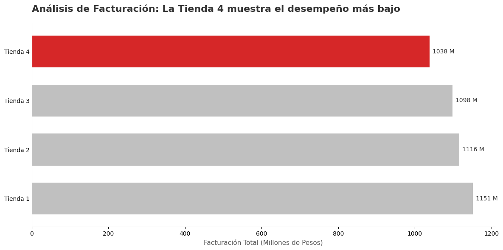
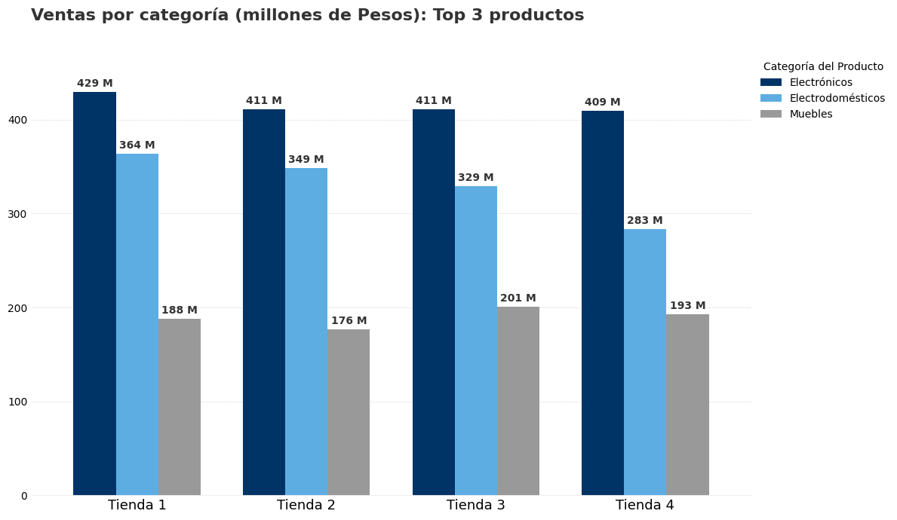
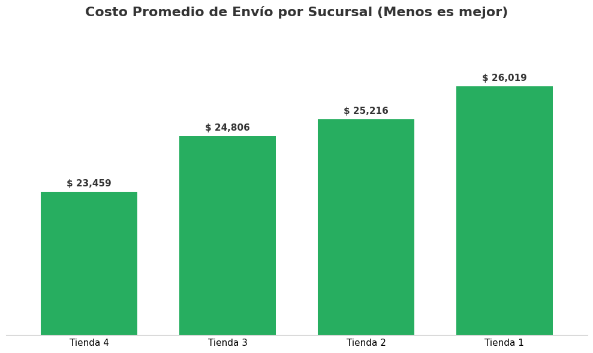

# 📊 Alura Stores: Strategic Performance Analysis


## 💼 Executive Summary

Este proyecto presenta un análisis forense de datos para la cadena minorista **Alura Stores**. El objetivo estratégico fue responder a una decisión crítica de negocio: **Identificar la sucursal con menor desempeño para su desinversión (venta).**

A través de un análisis exploratorio de datos (EDA) y visualización estratégica, se determinó que la **Tienda 4** es la unidad menos eficiente, no por problemas operativos, sino por una debilidad estructural en su mezcla de productos.

---

## 🎯 Business Challenge

El Sr. Juan (Stakeholder principal) requiere optimizar la cartera de activos de la empresa.
* **Objetivo:** Vender una sucursal para reinvertir capital.
* **Criterio:** Identificar la tienda con los peores indicadores de eficiencia financiera y comercial.
* **KPIs Analizados:** Facturación Bruta, Ingreso Neto (Profit), Satisfacción del Cliente, Costos Logísticos y Mix de Productos.

---

## 🔍 Key Insights & Data Storytelling

### 1. El Diagnóstico: Identificación de la Tienda menos Rentable
Al analizar la facturación bruta y el ingreso neto, la **Tienda 4** se posiciona consistentemente en último lugar, con una brecha significativa respecto a la tienda líder.

> **Insight:** La Tienda 4 es la única que no alcanza el umbral competitivo de ingresos netos del grupo.



---

### 2. Root Cause Analysis: ¿Por qué vende menos?
Se realizó un desglose profundo por categorías para entender la composición de la venta.
* **El Hallazgo:** La Tienda 4 falla críticamente en la venta de **Electrodomésticos**.
* **Impacto:** Al no vender productos de "Ticket Alto", su facturación total se desploma, a pesar de mantener un buen volumen de ventas en productos menores (Muebles, Accesorios).



---

### 3. Descarte de Hipótesis Operativas (La Defensa)
Antes de sugerir la venta, se validó que el problema **NO** fuera operativo. Los datos demuestran que la Tienda 4 es, de hecho, altamente eficiente en costos.
* **Logística:** Posee el **costo promedio de envío más bajo** de la cadena ($23k vs $30k de la Tienda 1).
* **Servicio:** Mantiene una calificación de **4.0**, en paridad con el resto del grupo.



---

## 🚀 Final Recommendation

Basado en la evidencia de datos, se recomienda proceder con la **venta de la Tienda 4**.

**Justificación:**
A pesar de ser operativamente eficiente (buenos envíos, buen servicio), su incapacidad para capturar el mercado de alto valor (Electrodomésticos) limita su rentabilidad neta. El problema es de mercado/ubicación, no de gestión interna.

---

## 💻 How to Run

1.  Clonar el repositorio:
    ```bash
    git clone [https://github.com/TuUsuario/TuRepo.git](https://github.com/TuUsuario/TuRepo.git)
    ```
2.  Instalar dependencias necesarias:
    ```bash
    pip install pandas matplotlib
    ```
3.  Ejecutar el Jupyter Notebook en VS Code.

---

<div align="center">
  <sub>Built with 🐍 by Kevin Mata | Data Science Enthusiast</sub>
</div>
